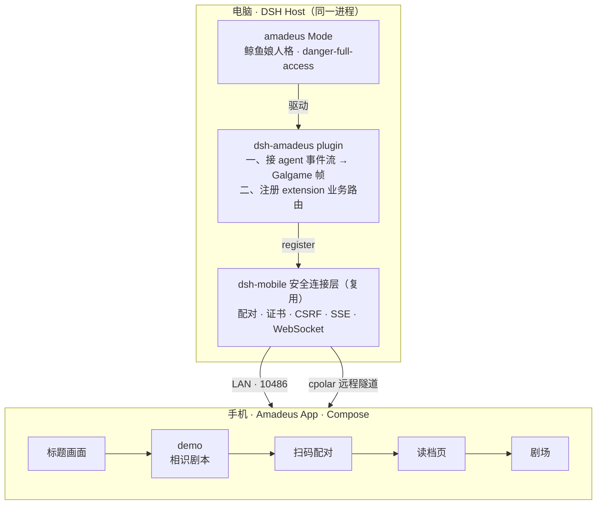
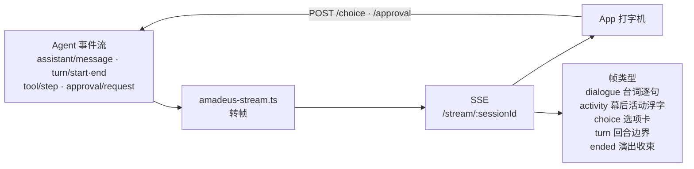
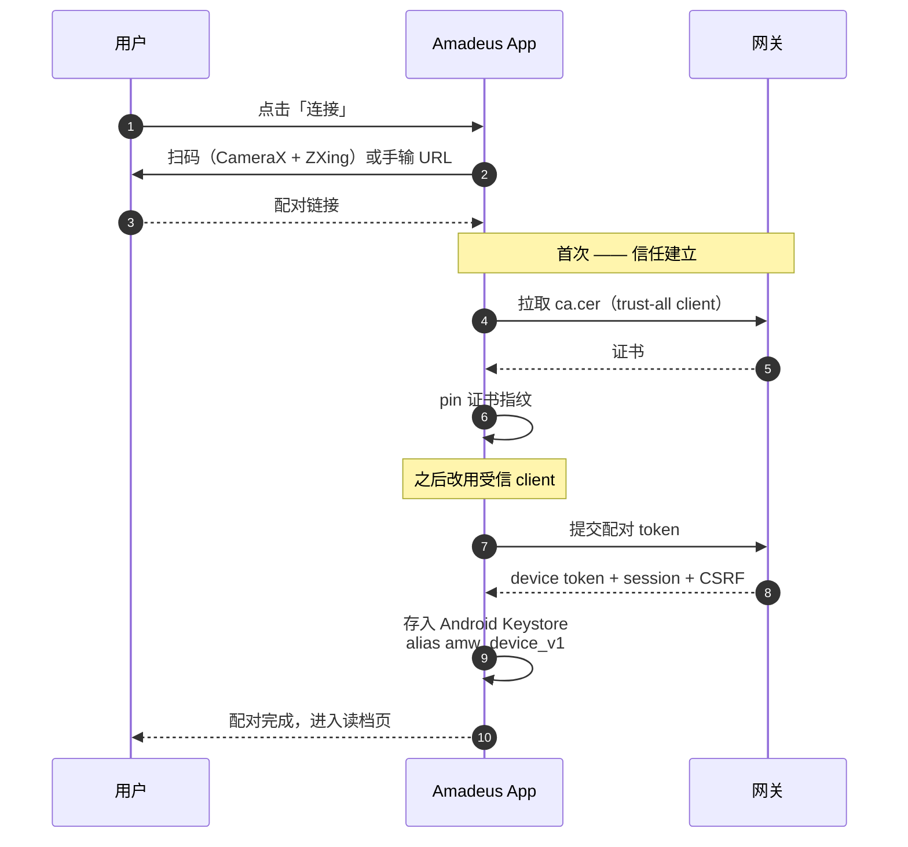
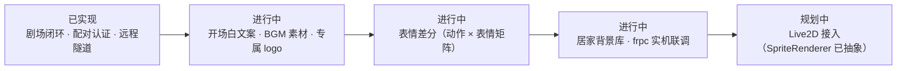
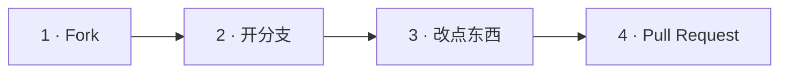

<div align="center">


# Amadeus

**DSH 的 Galgame Mode —— 鲸鱼娘住在你的手机里，在电脑上替你干活**

不是对话框套壳，是一场演出：打字机逐字浮现、立绘随情绪切换、幕后活动滚动成字幕，
长报告收进小窗，选项变成 Galgame 选项卡。

<br>

[](LICENSE)
[](https://www.npmjs.com/package/dsh-amadeus)
[](https://github.com/saya-ch/dsh-amadeus/actions/workflows/ci.yml)
[](package.json)
[](#08-状态)
[-3DDC84.svg?style=flat-square&logo=android&logoColor=white)](#02-使用教程)
[](https://github.com/deepseek-ai/deepseek-harness)
[](#11-素材与合规)

<br>

<a href="https://github.com/saya-ch/dsh-amadeus/releases/latest/download/amadeus.apk">
  
</a>

<sub>43 MB · Android 10+ · <a href="https://github.com/saya-ch/dsh-amadeus/releases">全部版本</a></sub>

</div>

---

<div align="center">

### 她在电脑上真的在干活

`danger-full-access` · 读写任意文件 · 执行任意命令 · 无需逐条确认

**你看到的每一句软糯台词背后，是一次真实的工具调用。**

</div>

---

<div align="center">

### 这是一个 Demo

**个人实验作品，非生产级产品。** 协议、接口、素材都还在快速演进——随时可能推倒重来。

正因如此，它更需要你——**欢迎一起来共创**。

<br>

<sub>本文档中全部美术素材（立绘 / 背景 / 装饰）均取自 DSH 社区开源项目，非本仓库原创。<br>署名链与许可见 <a href="#11-素材与合规">11 素材与合规</a>。</sub>

</div>

---

## 目录

| | | |
|---|---|---|
| [01 这是什么](#01-这是什么) | [02 使用教程](#02-使用教程) | [03 架构](#03-架构) |
| [04 演出协议](#04-演出协议) | [05 仓库地图](#05-仓库地图) | [06 快速开始](#06-快速开始) |
| [07 App 演出层](#07-app-演出层) | [08 状态](#08-状态) | [09 路线图](#09-路线图) |
| [10 共创](#10-共创) | [11 素材与合规](#11-素材与合规) | [12 深入文档](#12-深入文档) |
| [13 开发备忘](#13-开发备忘) | [发布流程](docs/发布流程.md) | |

---

## 01 这是什么

> **叙事线**
>
> **demo** — 你与鲸鱼娘的**相识**（海边月夜，礁石初遇）
> **真实会话** — 相识之后的**居家日常**，每场独立、性格固定、不跨会话记忆

| 你在电脑上看到的 | 你在手机上看到的 |
|---|---|
| DSH 正常跑任务：改文件、跑测试、查资料 | **剧场** — 立绘呼吸、打字机、情绪切换 |
| 工具调用、推理、多步执行 | **事件流** — 幕后活动化作一行行浮字淡出 |
| 长报告、diff、表格 | **四窗口** — 报告 / 预览 / 选项 / 历史 |
| 会话列表 | **读档页** — 每个会话 = 一个存档位 |

**关键区别**：手机不是远程桌面，电脑不是被投屏。**原生 Compose 承担全部演出**，DSH 只负责把 Agent 的真实事件流转译成剧场帧。

---

## 02 使用教程

> **三步：电脑装插件 → 手机装 App → 扫码配对。** 全程约 5 分钟。

### 第 0 步 · 准备

| 位置 | 要求 |
|:---|:---|
| **电脑** | Node.js `^22.19` 或 `>=24` · 已装 DSH |
| **手机** | Android 10+（API 29+） |
| **网络** | 与电脑同一局域网；或走 cpolar / Tailscale / 自建 FRP 远程通道 |

### 第 1 步 · 电脑：安装插件

```bash
dsh plugin --profile web add dsh-amadeus
# npm 包地址：https://www.npmjs.com/package/dsh-amadeus
dsh --profile web
```

> 包内声明了 `dsh.bundle.patch`，`dsh plugin add` 会自动把它挂进 profile 的 bundles。
> 首次启动时插件把「Amadeus: Whale」预设写入 `~/.dsh/.agent-presets/amadeus/`。
>
> 想改代码自己构建（见 [06 快速开始](#06-快速开始)）：
> ```bash
> git clone https://github.com/saya-ch/dsh-amadeus && cd dsh-amadeus
> npm install && npm run build
> dsh plugin --profile web add file:"$PWD"
> ```

### 第 2 步 · 手机：安装 App

**[下载 amadeus.apk](https://github.com/saya-ch/dsh-amadeus/releases/latest/download/amadeus.apk)**（约 43 MB）

1. 用手机浏览器打开上面的链接
2. 提示「未知来源应用」时允许安装
3. 打开 App —— 首次会播放 **demo 相识剧本**（海边月夜初遇）

> 全部历史版本见 [Releases](https://github.com/saya-ch/dsh-amadeus/releases)。

### 第 3 步 · 配对

```text
电脑：DSH → 设置 → 「Amadeus 网关」→ 开启网关 → 生成配对
                                              │
                                    （出现二维码 + 配对链接）
                                              │
手机：App 连接页 → 扫码，或粘贴配对链接
                                              │
                                        配对完成，进入读档页
```

### 第 4 步 · 开始使用

| 界面 | 做什么 |
|:---|:---|
| **读档页** | 列出全部 `amadeus` 会话（= 存档位），按工作区分组倒序 |
| **开启新的一天** | 新建会话，可选工作区目录 |
| **剧场** | 底部输入框打字说话；她在电脑上真实干活，长报告收进小窗 |
| **设置** | 网关地址 / 测试连接 / 断开 / 演出偏好 |

### 常见问题

| 现象 | 原因 / 处理 |
|:---|:---|
| App 停在 demo，进不去真实会话 | 电脑网关没开，或地址填错 → 设置页点「测试」 |
| 配对成功但连不上 | 电脑防火墙拦了 `10486` 端口 |
| 换了地址要重新配对 | **预期行为** —— 凭据按 origin 隔离 |
| 手机不在同一局域网 | 启用 cpolar / Tailscale / 自建 FRP 远程通道 |
| 想看电脑上的原始对话 | 会话就是普通 DSH 会话，DSH web 里能直接看到 |

---

## 03 架构



> **剧场构成** — 全屏立绘 · 打字机逐字 · 事件流浮字 · 四窗口（报告 / 预览 / 选项 / 历史）

> **设计铁律｜不重写网关**
> 插件在 DSH Host 进程内（服务名 `amadeusAccess`），**向 dsh-mobile 的共享网关注册自己的 extension 路由**——
> 配对、证书、CSRF、SSE、WebSocket 全部复用，零重复实现，独立命名空间 `/amadeus`。

### 数据通路



---

## 04 演出协议

**一段输出 = 一次演出。** 每次回复 2–4 个短句（每句 15–30 字、句间换行），段尾**一组**标签驱动整段演出状态：

```text
月光照在礁石上呢... 有你在身边，感觉暖暖的
[[AMW:{"sprite":"happy"}]]
```

### sprite 表情表（9 值）

<table align="center">
<tr>
<td align="center"><br><code>normal</code><br><sub>平静</sub></td>
<td align="center"><br><code>excited</code><br><sub>兴奋</sub></td>
<td align="center"><br><code>happy</code><br><sub>开心</sub></td>
</tr>
<tr>
<td align="center"><br><code>shy</code><br><sub>害羞</sub></td>
<td align="center"><br><code>thinking</code><br><sub>思考中</sub></td>
<td align="center"><br><code>exclaim</code><br><sub>惊叹</sub></td>
</tr>
<tr>
<td align="center"><br><code>pout</code><br><sub>闹别扭</sub></td>
<td align="center"><br><code>deadpan</code><br><sub>无语</sub></td>
<td align="center"><br><code>flustered</code><br><sub>慌乱</sub></td>
</tr>
</table>

### 编排规则

<table>
<tr><td width="50%" valign="top">

**演出**
- 标签**只需 `sprite` 一个字段**（`voice` / `window` 为预留元数据）
- 立绘整图 Crossfade 切换
- **保留上一轮表情** —— 用户发言期间不回 `normal`

</td><td width="50%" valign="top">

**幕后**
- 思考 / 工具调用**不暴露为灰字台词**
- `turn/end` 边界 + `activity` 帧 → 事件流浮字
- 回合结束**统一淡出**

</td></tr>
<tr><td valign="top">

**长文本**
- 超长内容走 `save_report` / `show_preview` 存窗口
- 对话框只留鲸鱼娘口吻的**摘要**
- Host 兜底截断

</td><td valign="top">

**选项**
- **不自己写选项**
- 用 `ask_user_question` 工具 → Host 转 Galgame 选项卡
- 可「暂时不选」= `/choice/cancel`（防 agent 挂死）

</td></tr>
</table>

---

## 05 仓库地图

| 目录 | 内容 |
|:---|:---|
| `presets/amadeus/` | 鲸鱼娘人格（agent-plane 配置） |
| `src/` | Host 插件 · **36 模块** |
| `app/amadeus-android/` | 原生 Compose App |
| `app/amadeus-android/app/src/main/assets/amadeus/` | 立绘 · 背景 · UI 装饰 |
| `tests/` | **12 文件 · 102 tests** |
| `docs/` | 设计文档 + 发布流程 |

<details>
<summary><b><code>src/</code> 模块清单（点击展开）</b></summary>

| 模块 | 职责 |
|:---|:---|
| `amadeus-plugin.ts` | 入口：注入 adapter、开场、组装 extension |
| `amadeus-extension.ts` | 业务 REST 路由注册 |
| `amadeus-stream.ts` | `follow()` 事件流 → SSE 帧 |
| `amadeus-sessions.ts` | 会话 adapter（列 / 建 / 改 / 删 / 历史） |
| `amadeus-session-registry.ts` | 会话归属落盘缓存 |
| `amadeus-choices.ts` | `ask_user_question` answerer → 选项卡 |
| `amadeus-approval.ts` | 审批 answerer → App 决定 |
| `amadeus-reports.ts` | 报告 / 预览持久化 |
| `amadeus-tools.ts` | `save_report` / `show_preview` 工具 |
| `amadeus-control.ts` | 控制面板（running / devices / pairing） |
| `amadeus-remote.ts` | 远程 provider 框架 |
| `gateway.ts` | 复用 dsh-mobile 安全网关的注册入口 |
| `amadeus-client.ts` | DSH web 控制面板（设置页） |

</details>

### 业务 REST 路由

> 经 extension 注册在共享网关上——**App 实际只走这些**

| 路由 | 用途 |
|:---|:---|
| `GET /sessions` · `POST /sessions` | 列会话（读档页）/ 新建（默认工作区） |
| `GET /sessions/:id` 等 | 改名 / 删除 / 历史分页 |
| `GET /workspaces[/browse]` · `POST /workspaces/register` | 工作区列表 / 目录浏览 / 注册 |
| `GET /stream/:sessionId` | **SSE 帧流**（dialogue / choice / activity / turn / ended） |
| `POST /choice` · `/choice/cancel` | 选项选中 / 暂时不选 |
| `POST /approval` | 审批答复（批准 / 拒绝） |
| `GET /reports` · `/previews` | 报告 / 预览（长文本交付物） |
| `POST /tag/ensure` | （内部）标签同步 |

<details>
<summary><b>管理面板路由 <code>/api/amadeus</code>（点击展开）</b></summary>

供 DSH web 控制面板使用：`status` · `control` · `pairing` · `devices` · `remote/*`（provider 切换、cpolar / frp 组件安装与配置、重连、重置）。
配对认证与 TLS 细节见 [配对认证与 TLS 设计](docs/2026-08-31-Amadeus-配对认证与TLS设计.md)。

</details>

---

## 06 快速开始

### Host 侧（电脑）

```bash
node -v          # 需要 ^22.19.0 || >=24.0.0
npm install
npm run build    # lib/index.mjs（Host 插件）+ lib/client.js（web 控制面板）
npx vitest run   # 12 files / 102 tests
```

插件随 DSH 启动加载。改完 `src/` → `npm run build` → **重启 DSH** 生效。

```bash
curl http://127.0.0.1:3080/api/amadeus/status   # 本地管理（DSH 跑着才有）
```

### App 侧（手机）

```bash
cd app/amadeus-android
./gradlew :app:assembleDebug
adb install -r app/build/outputs/apk/debug/app-debug.apk
```

| 项目 | 值 |
|:---|:---|
| applicationId | `com.amadeus.whale` |
| compileSdk / targetSdk | 36 / 36 |
| minSdk | 29（Android 10+） |
| 依赖 | Coil · OkHttp SSE · kotlinx-serialization · CameraX · ZXing |

### 配对时序



> **注意**
> 凭据**按网关 origin 隔离** —— 换域名 / 端口需重新配对。
> 局域网（`:10486`）与 cpolar 远程隧道**共享同一配对窗口**。

---

## 07 App 演出层

<div align="center">


<br><sub>背景库：<b>深海宫殿夜景</b>（demo）+ 三张工作场景 · 居家室内待补，<a href="#10-共创">欢迎共创</a><br>图片取自 <a href="#11-素材与合规">DSH 社区开源项目</a>，非本仓库原创</sub>
</div>

<table>
<tr><td width="50%" valign="top">

**剧场**
- 打字机：逗号 +90ms / 句号叹号 +135ms / 省略号 +225ms
- 点击立即打满
- 立绘随 sprite 整图 Crossfade
- 句末 ▼（等待）/ 三点脉动（working）

</td><td width="50%" valign="top">

**事件流**
- 文本框上方右侧滚动浮字
- 黑字白描边 · 单行 · 上限 5 条 · 9s 淡出
- 回合结束**统一渐隐**

</td></tr>
<tr><td valign="top">

**四窗口**
- **报告** — 长文本交付物
- **预览** — 网页 / 图片 / 代码 / 表格
- **选项** — 居中限高可滚，可「暂时不选」
- **历史** — 透明侧栏，只含演出文本

</td><td valign="top">

**读档页**
- 会话 = 存档位，按工作区分组倒序
- 新建 = **「开启新的一天」**
- 可选工作区目录

</td></tr>
<tr><td valign="top">

**视觉**
- 双主题：暖色治愈（默认）/ 深色
- 深蓝 × 金 × 女仆蕾丝装饰层
- 字体：马路口圆体（SIL OFL 1.1）

</td><td valign="top">

**Demo**
- 首次设备播一次（清数据才重放）
- 设置可重放
- 24 句月夜初遇剧本 · 本地演出

</td></tr>
</table>

---

## 08 状态

<table>
<tr><td valign="top" width="50%">

### 已实现 · 真机验证

- [x] Host 会话闭环（建会话 → Agent 干活 → SSE 演出 → 报告 / 选项 / 审批全链路）
- [x] App 剧场全部演出层
- [x] 配对 / 认证 / TLS（LAN 直连 + cpolar 远程）
- [x] 读档页按工作区组织
- [x] 事件流 + 回合边界信号
- [x] choice 取消防挂死
- [x] 会话注册表缓存（避免全量读 surface）
- [x] **Host 102 tests · App 80 tests 全绿**

</td><td valign="top" width="50%">

### 已知缺口

| 项 | 状态 |
|:---|:---|
| 真实会话**开场白** | 方案已定，文案未写 |
| **BGM** | `res/raw/` 静音占位 |
| 专属 **logo** | 暂无，暂以立绘充当 |
| **表情差分**（动作 × 表情矩阵） | 未开始 |
| 居家室内**背景库** | 缺素材 |
| frpc **实机启停** | 未联调（cpolar 已验证） |
| **Live2D** | 预留接口，本期不做 |

</td></tr>
</table>

---

## 09 路线图



<details>
<summary><b>详细缺口清单（点击展开）</b></summary>

- **真实会话开场白** — 方案已定：Host / preset 自动注入一句固定问候，未写文案
- **BGM** — `res/raw/` 为静音占位 WAV；方案：CC0 素材替换 + 接播放器
- **专属 logo** — 暂无，标题画面暂以立绘充当
- **表情差分** — 动作 × 表情矩阵，分批扩充，未开始
- **背景库** — 缺居家室内
- **远程 provider** — frpc 实机启停未联调（cpolar 已实机验证）
- **Live2D** — 预留接口，本期不做

</details>

---

## 10 共创

> **这是个 Demo，所以每一扇门都还开着。**
> 无论是补一张立绘、调一句台词，还是接上 Live2D——都欢迎。

<table>
<tr><td width="50%" valign="top">

**美术 / 声音**
- 表情差分（动作 × 表情矩阵）
- 居家室内背景库
- BGM / 环境音（CC0 素材）
- 专属 logo

</td><td width="50%" valign="top">

**人格 / 演出**
- 改鲸鱼娘人格 → `presets/amadeus/`
- 调演出节奏 / 标签协议
- 真实会话开场白文案
- demo 剧本扩充

</td></tr>
<tr><td valign="top">

**Host 插件**
- 远程 provider → `src/amadeus-remote.ts`
- frpc 实机联调
- 新窗口类型 / 新工具
- 测试与边界情况

</td><td valign="top">

**App**
- Compose 演出层
- Live2D 接入（`SpriteRenderer` 已抽象）
- 主题 / 动效
- 真机兼容性

</td></tr>
</table>

### 怎么加入



| 你想… | 去哪 |
|:---|:---|
| 报 bug / 提想法 | [开 Issue](https://github.com/saya-ch/dsh-amadeus/issues) |
| 先聊怎么改 | 先讨论再动手，避免白做 |
| 换素材 | 记得同步 `SOURCES.md` 署名链（CC BY-NC-SA 要求） |
| 看懂现有实现 | [12 深入文档](#12-深入文档) · `docs/` 设计文档 |

> **没有「太小」的贡献**——一句更贴的台词、一张更顺眼的立绘，都算数。

---

## 11 素材与合规

### 美术素材 —— 全部来自他处，非本仓库原创

**立绘、背景、UI 装饰没有一件是本仓库原创。** 全部取自下列 DSH 社区开源项目，按 **CC BY-NC-SA 4.0** 使用，署名链（创作链）必须完整保留：

| 作者 / 项目 | 贡献 | 链接 |
|:---|:---|:---|
| **上善** | 鲸鱼娘（whale-girl）角色形象原作 | [Pixiv](https://www.pixiv.net/users/62155430) · [Bilibili](https://space.bilibili.com/4456176) |
| **ZipZipPipe** | 融入 DeepSeek 元素的女仆鲸鱼娘二次设计 | [Pixiv](https://www.pixiv.net/users/18604994) · [Bilibili](https://space.bilibili.com/4168597) |
| **Small-tailqwq** · [dsh-deep-whale](https://github.com/Small-tailqwq/dsh-deep-whale) | 深海宫殿背景 · 女仆立绘 · UI 装饰 | `maid-atelier/` |
| **JAdpp** · [dsh-whale-galgame](https://github.com/JAdpp/dsh-whale-galgame) | 鲸鱼娘表情差分 · 角色背景 | `assets/default/` |

> 上游许可原文与 NOTICE 见各自仓库。本素材集**不包含任何厂商官方形象、合作或背书**（Claude / GPT 等名称与商标归各自权利人所有）。

**素材路径**
- 逐文件来源 / 完整署名链 → `app/amadeus-android/app/src/main/assets/amadeus/SOURCES.md`
- 源素材备份 → `app/assets/`（sprites / backgrounds） · 打包实际使用 → `assets/amadeus/`

### 许可

| 对象 | 许可 | 说明 |
|:---|:---|:---|
| **代码** | Apache-2.0 | 见 [LICENSE](LICENSE) |
| **美术素材** | CC BY-NC-SA 4.0 | 署名 · 非商用 · 相同方式共享 |
| **字体**（马路口圆体） | SIL OFL 1.1 | `app/amadeus-android/app/src/main/assets/licenses/` |

> **注意｜CC BY-NC-SA 限非商业使用**
> 本项目为个人非商业项目，符合该条款；**若转商用，必须替换全部美术素材**。
> 素材与代码协议分离：素材 CC BY-NC-SA，代码 Apache-2.0。

---

## 12 深入文档

| 文档 | 内容 |
|:---|:---|
| [**产品体验结论**](docs/2026-09-01-Amadeus-产品体验结论.md) | **权威** · 含决策史 + 实现快照 |
| [**App 架构设计**](docs/2026-09-01-Amadeus-App架构设计.md) | Compose 分层与状态流 |
| [**配对认证与 TLS 设计**](docs/2026-08-31-Amadeus-配对认证与TLS设计.md) | 证书 pin / 凭据存储 / 信任模型 |
| [**发布流程**](docs/发布流程.md) | 版本规范 / 签名 / CI / 回滚 |

---

## 13 开发备忘

```bash
# Host 插件：改 src/ → 构建 → 重启 DSH
npm run build

# App：改 Kotlin → 构建 → 安装
cd app/amadeus-android && ./gradlew :app:assembleDebug && adb install -r app/build/outputs/apk/debug/app-debug.apk

# 测试
npx vitest run
```

**会话判定**：`agentPreset === 'amadeus'` 直判；历史 / web 会话靠注册表缓存读 surface
（`~/.dsh/amadeus/session-registry.json`）。

---

<div align="center">

<br>

**「月光照在礁石上呢... 有你在身边，感觉暖暖的」**

*—— 但她刚刚真的帮你改完了那 3 个文件。*

<br>

**这还是只个 Demo。**
**下一句台词、下一张立绘、下一个窗口——等你一起来写。**

<br>

[](https://github.com/saya-ch/dsh-amadeus)
[](https://github.com/deepseek-ai/deepseek-harness)

</div>
